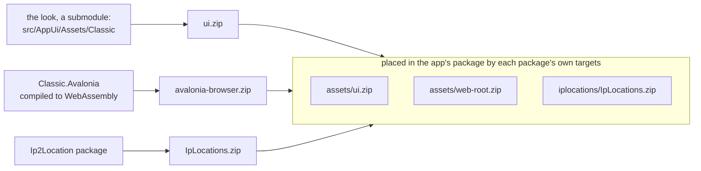
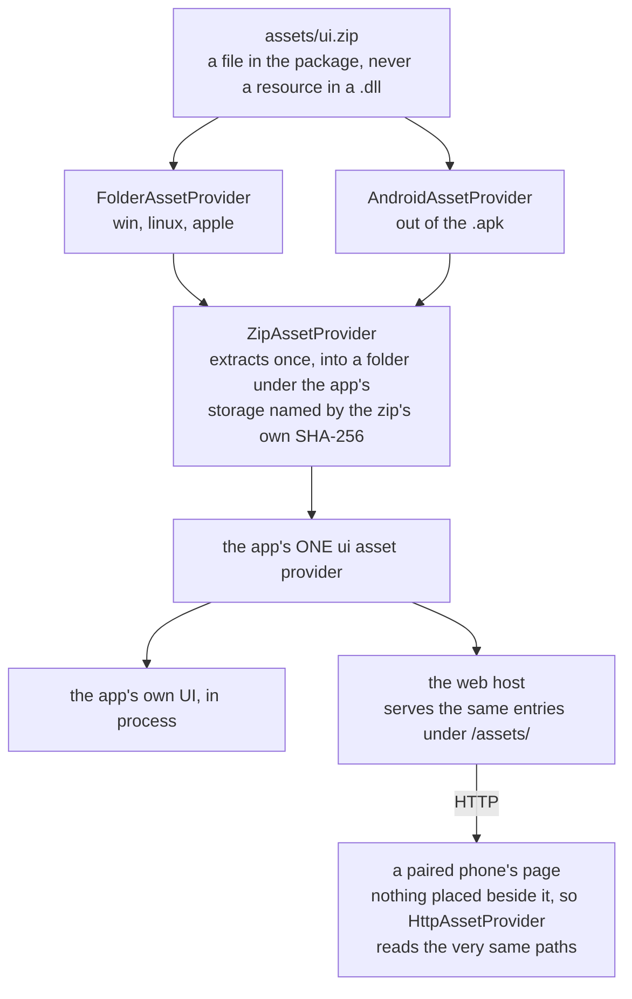

# Assets — how data files ship, and how code reads them

Pictures, fonts, words, a country database and a whole web UI all reach the app the same way: as a
zip placed beside it by MSBuild, read through one interface.

## What ships as a zip

| Placed at | Built by | Named in `AppOptions` as | Holds |
| --- | --- | --- | --- |
| `assets/ui.zip` | `VpnHood.AppUi.Assets.Classic` | `UiZipAssets` | images, country flags, fonts, content documents, the words of every language, the per-theme branding the OS chrome draws with |
| `assets/web-root.zip` | `VpnHood.AppUi.Presentation.Classic.Avalonia.Browser` | `WebRootZipAsset` | the page the app's web host serves to a paired device |
| `iplocations/IpLocations.zip` | `VpnHood.Core.IpLocations.Assets.Ip2LocationLite` | `IpLocationZipAsset` | the IP-to-country ranges |

One zip rather than loose files, because packaging is one item per platform: one `AndroidAsset`,
one `BundleResource`, one copy-to-output item — instead of a rule per file, per platform, that
misses whatever is added later.

The zip carries its own version. `ZipAssetProvider` names the extracted copy after the first
sixteen hex digits of SHA-256 over the zip itself, so nothing travels beside it to say which build
it came from, and an unchanged zip is never extracted twice.

## How a zip is placed

Each producing package owns a `build/*.targets` that places its own file, and each owns a distinct
folder in the consuming app. The placement is one item per platform:

```text
AndroidAsset     Link="assets\assets\ui.zip"    the folder name twice on purpose: .NET for Android
                                                 treats a leading assets\ as the package's asset
                                                 root and drops it
BundleResource   Link="assets\ui.zip"           iOS, tvOS: a file of the app bundle, read in place
None + copy      Link="assets\ui.zip"           Windows, Linux: a file beside the executable
```

## How code reads one

Two small types in `VpnHood.Core.Toolkit` carry all of it.

`IAssetProvider` answers a stream by name, asynchronously, and nothing else:

```csharp
Task<Stream> OpenReadAsync(string assetPath, CancellationToken cancellationToken);
```

`Asset` is a provider plus a path as one value, which is what a head hands to `AppOptions`:

```csharp
UiZipAssets     = [new Asset(platformAssets, "assets/ui.zip")],
WebRootZipAsset = new Asset(platformAssets, "assets/web-root.zip"),
```

There is one implementation per **platform**, not per set of files, so a new set of files is a new
path and nothing else:

| Provider | Where it reads |
| --- | --- |
| `FolderAssetProvider` | beside the executable, or inside an app bundle — Windows, Linux, iOS, tvOS |
| `AndroidAssetProvider` | out of the `.apk` through `AssetManager` |
| `ZipAssetProvider` | inside a zip, by extracting it once under the app's storage |
| `HttpAssetProvider` | over HTTP, for a page that has nothing placed beside it |
| `CompositeAssetProvider` | several providers in order, first hit wins — how a fork overrides single files |

A missing asset throws `AssetNotFoundException` and that type exactly, so a caller that is *asking*
rather than requiring — a language falling back to another, a picture that may not exist — uses
`TryOpenReadAsync` and gets null.

### What the build produces, and where it lands



### How a read reaches the bytes



The app builds **one** provider over all the UI zips a head names. Because the page reads the same
paths the in-process UI reads, `AppAssets`, the fonts and `Strings` are identical in both places and
only the provider underneath differs.

## The page a paired device opens

The app's web host serves a page to a phone paired with a TV, and to the app's own web view. That
page is the same Avalonia UI the app itself draws, compiled to WebAssembly — one UI codebase, one
set of pages, one store of images and words, rather than a second front end in HTML that would have
to be changed for every feature.

What follows from that:

- **Interpreted, not AOT.** The bundle is served over the LAN for a few minutes of settings; AOT
  roughly doubles the download for no benefit at that duration.
- **Trimmed in full.** The app's own assemblies are referenced for their DTOs alone, so
  `TrimMode=full` is affordable; the reflection JSON path stays on for the few places shared code
  needs it.
- **The assets are fetched, not bundled.** They already exist on the server that sent the page.
- **Built with the .NET 10 SDK**, pinned by a `global.json` in the page project's folder, with the
  `wasm-tools` workload.
- **Cache headers follow the bundle's own fingerprints.** `dotnet.native.<hash>.wasm` is immutable;
  `index.html`, `main.js` and `dotnet.js` are no-cache.

The bundle is 7.3 MB zipped, 20.1 MB extracted, 64 files.

## Adding a set of files

1. Put them in a package of the shape described in
   [`src/AppUi/Assets/Classic/README.md`](../src/AppUi/Assets/Classic/README.md), which has the id
   convention.
2. Give it a folder of its own in the consuming app. Never `assets/`, which is taken.
3. Place it with targets in `buildTransitive/`, and a `build/` file that imports them.
4. Have the head name it in `AppOptions` as an `Asset`. Nothing below the head knows the path.

## What not to do

Every one of these has cost us a release cycle, and every one of them fails **silently** — green
build, working app, wrong result.

1. **Never `EmbeddedResource` for data.** Android keeps one assembly store per CPU architecture, so
   bytes inside a `.dll` ship once per ABI. An identical, architecture-neutral blob is carried three
   times; on one Android bundle that was 44 MiB of 64. Only the download size ever shows it.
2. **Never decide "is this an app?" from `OutputType` alone.** The .NET for Android SDK rewrites an
   app's `Exe` to `Library`, so that test places nothing on the one platform where the per-ABI cost
   is worst. Test `AndroidApplication == 'true'` as well. Found by unzipping the APK, never by a
   build error.
3. **Never rename an asset package without renaming both targets files.** NuGet imports
   `build/<PackageId>.targets` and `buildTransitive/<PackageId>.targets` by name and by name only.
   A mismatch imports nothing and places nothing. Verify inside the packed `.nupkg`, not in the
   source folder.
4. **Never put the placement only in `build/`.** That reaches a direct `PackageReference` and
   nothing deeper. Put it in `buildTransitive/` with a `build/` file that imports it. Note also that
   `PrivateAssets="all"` or `ExcludeAssets="build"` anywhere on the path stops the flow, and a
   `ProjectReference` never flows targets at all — which is why heads in this repo import the
   targets directly.
5. **Never give two packages the same folder.** A `ZipAssetProvider` owns its extraction folder and
   deletes everything in it that is not the version in hand.
6. **Never build the browser page with the .NET 11 preview.** Its Emscripten cannot link SkiaSharp's
   WebAssembly libraries, and the 11 SDK skips the native relink for a `net10` target saying only
   "Publishing without optimizations". The result is a bundle with no Skia in it that does not draw.
7. **Never build a second provider over a zip another one already owns.** It extracts the same bytes
   a second time into a second folder.
8. **Never ship the words as `.resx`.** Satellite assemblies are assemblies, so they land back in
   the per-ABI store this whole page exists to avoid, and a third party cannot add one to our
   signed assembly. The words are JSON files in the store, and a fork lays its own over ours with
   `IStringSource`.
9. **Never assume a stream can seek.** An Android asset and an HTTP body cannot. A reader that needs
   two passes opens the asset twice, or buys it into memory with
   `ToMemoryStreamIfNotSeekableAsync` — so the cost is paid where it is decided.

## See also

- [source-layout.md](source-layout.md) — where these projects live and what a head is made of
- [`src/AppUi/Assets/Classic/README.md`](../src/AppUi/Assets/Classic/README.md) — the asset package
  itself: what is in it, and how to make another
