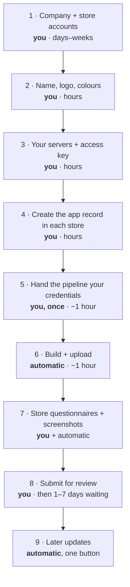

# Publish your own VPN app — start here

**For:** anyone who wants their own branded VPN app in the app stores, with their own name, logo
and (optionally) their own paid subscriptions.

You do not need to be a programmer. The building, signing and uploading is done for you by an
automated pipeline. What is left for you are the things the stores only accept from a real human
with a real company — opening accounts, signing agreements, entering your bank details, answering
review questionnaires, pressing *Submit* — plus, today, **a handful of small text edits** to put
your name and your identifiers into the project ([step 8](#8-making-it-yours)). They are
find-and-replace edits, not programming, and the [managed path](#2-three-ways-to-get-there) removes
even those.

This page is the map. It tells you what to prepare, what order to do things in, and which of the
detailed pages to open at each step. Read it once from top to bottom before you start anything —
several decisions here are painful to change later.

> **Not legal or tax advice.** You publish under your own name, your own company and your own
> responsibility. Store rules and fees change; always confirm on the store's own page.

---

## 1. What you end up with

- Your own VPN app, under **your** brand, on the **Apple App Store** and **Google Play** — and, if
  you want them, a **Windows** installer and **Linux** packages you host yourself.
- Your users connect through **your** servers.
- Optionally, **paid subscriptions** sold through the stores, with customers and invoices managed
  in your own billing portal.

What you do **not** get: a business. Servers cost money, support takes time, and app stores treat
VPN apps more strictly than almost any other category. Read [What the stores demand of VPN
apps](#3-what-the-stores-demand-of-vpn-apps) before spending anything.

> **Know this before you plan an iPhone launch.** Today the pipeline sends a CONNECT-style app to
> **TestFlight only** — Apple's testing channel, not the public App Store. Everything else (the
> listing, subscriptions, screenshots) publishes normally, and the last step to the public store is
> a deliberate one-line change we have not switched on yet. If a public iPhone release is your goal,
> talk to us about timing before you start.

---

## 2. Three ways to get there

| | How it works | Available |
| --- | --- | --- |
| **A — Managed** | You give us your app name, logo and colours, plus temporary access to your store accounts. We build, publish and hand the accounts back. | **Planned** — ask us |
| **B — Starter repo** | You get a small project of your own that pulls in our ready-made building blocks. You own it; our pipeline publishes it. | **Planned** |
| **C — Fork** | You copy the whole VpnHood project into your own account and turn the publishing pipeline on. | **Available today** |

This guide describes **C**, the path that works today. A and B take the technical middle of the
journey off your hands — copying the project, branding it, wiring up the pipeline. Everything the
stores require of *you* as the publisher — accounts, agreements, bank details, questionnaires,
submission — stays yours on every path.

---

## 3. What the stores demand of VPN apps

Read this section before you spend a cent. Every item below has caused real apps to be rejected or
removed.

1. **You must be a company, not a person.** Apple accepts a VPN app only from the organization that
   actually provides the VPN service, submitted from an **organization** developer account. A
   personal account is rejected no matter how good the app is. Registering a company takes days to
   weeks and usually needs a business number (D‑U‑N‑S). Start here, not last.
2. **You must own the VPN service.** Reselling somebody else's VPN under your logo is against the
   same rule. In practice: you run the servers behind your app.
3. **Your app will be rated 17+.** The rating questionnaire asks about unrestricted web access; a
   VPN provides it. Answering otherwise is grounds for removal.
4. **You need your own privacy policy**, on your own website, describing *your* data practices
   under *your* name. You cannot reuse ours.
5. **You must rebrand.** The licence gives you the code, not the VpnHood name or logo. A copycat
   app is rejected under a separate rule.
6. **Some countries must be switched off** before your first release — selling a VPN there gets the
   app pulled and leaves a mark on your account. Which ones and why:
   [App Store territories](../legal/developer/APP_STORE_TERRITORIES.md).
7. **Encryption paperwork applies to you.** It is routine and free, but it is not optional:
   [export compliance](../legal/developer/APP_STORE_EXPORT_COMPLIANCE.md).

Details and the reasoning behind each: [App Store privacy & policy
checkpoints](../legal/developer/APP_STORE_PRIVACY.md).

---

## 4. What to prepare

Gather these before touching any store console. Rough figures — confirm current prices yourself.

| # | What | Roughly | Notes |
| --- | --- | --- | --- |
| 1 | A registered **company** | varies | Required for Apple (see above). Also what your users will see. |
| 2 | **Apple Developer Program**, organization | ~99 USD / year | Enrolment review can take days to weeks. |
| 3 | **Google Play Developer** account | ~25 USD once | Identity verification required. |
| 4 | **VPN servers** and an access key | your hosting cost | This is your actual product. See [step 6](#6-your-servers-and-your-key). |
| 5 | A **domain**, a support email, a privacy‑policy page | small | The stores publish these; they must work. |
| 6 | An **app name** and a **logo** | — | Name must be free in both stores. Not similar to VpnHood. |
| 7 | A **GitHub account** | free | Where your copy of the project lives and where the pipeline runs. |
| 8 | *(Only if you sell subscriptions)* a **billing portal** and a **bank account** the stores can pay into | varies | See [step 10](#10-optional-selling-subscriptions). |

**You can ship without selling anything.** If you never set up a billing portal, the app simply has
no accounts and no purchases in it — it connects with your key and nothing else. That is the
simplest first release, and you can add selling later.

---

## 5. The journey at a glance

Each phase says who does it. **You** means a human in a browser — no software can do it for you.

Expect **four to eight weeks** from nothing to a live app, most of it spent waiting for other
people: company registration, Apple enrolment, store review.

---

## 6. Your servers and your key

Your app is a door; the servers are the building. Before publishing you need at least one VpnHood
server running, and an **access key** — one line of text that tells the app where to connect and
what the user is allowed to do.

- Run a server: [VpnHood server installation](https://github.com/vpnhood/VpnHood.App.Server) and
  the [server publishing notes](../cicd/server-publishing.md).
- The access key is built into your app when the pipeline builds it, so your users connect on first
  launch without typing anything.
- If you plan to sell premium plans **and** offer a free tier, you will end up with two keys — one
  for the free/ad-supported build and one for the paid builds. The pipeline expects them by name;
  the exact names are in [deployment](../cicd/deployment.md).

**Treat the key like a password.** Anyone who has it can use your servers.

---

## 7. Creating the app in each store

This is the part with the most hand work, and it must happen **before** the first automated upload:
the pipeline can upload a build into an app that already exists, but it cannot create the app,
accept an agreement, or answer a questionnaire for you.

- **Apple:** [Apple App Store — the steps only you can do](apple-app-store.md)
- **Google:** [Google Play — the steps only you can do](google-play.md)
- **Windows and Linux:** nothing to create. The installer and packages are published as downloads
  on your own project page. Signing the Windows installer is optional but recommended —
  unsigned installers show a scary warning. See [deployment](../cicd/deployment.md).

---

## 8. Making it yours

The project you copied is still branded as VpnHood. Before the first build, a few values have to
become yours. There is no programming here — you are replacing text — but the values must be exact,
and most of them **can never be changed after your first release**.

| What | Why it matters |
| --- | --- |
| **App name** shown under the icon | Yours, and not confusingly similar to VpnHood — copycat apps are rejected. |
| **Identifiers** for Android and for iOS (app + VPN part) | Permanent. They tie your build to the app records you created in step 7. |
| **Logo and colours** | The app currently ships with two built-in looks; adding yours means adding your logo file and colour set. |
| **Your links** — website, download page, support | They appear in the app and on the store listing. |
| **Your privacy policy and terms of use** | Pages on your own domain. Both stores require the policy, and Apple wants both openable from the purchase screen. |
| **Two settings blocks** pasted into your project's settings | One describes your app (name, identifiers, links), one holds its runtime settings. They travel with the project rather than living in files. |

Two warnings from experience:

- **All or nothing.** If those settings blocks exist, they must be complete — a half-filled one
  stops the build with a clear message rather than quietly publishing something wrong. That is
  deliberate: it is how a wrong identifier is caught before it reaches a store instead of after.
- **A freshly copied project may show no "Actions"** to run. Making one small change to each
  automation file and saving it registers them. The publish script checks this and tells you.

Exactly which values, and where each one lives: [deployment](../cicd/deployment.md). This is the
step the [managed and starter-repo paths](#2-three-ways-to-get-there) remove entirely.

---

## 9. Handing the pipeline your credentials

The automation needs permission to act on your behalf: to sign the app and to upload it. You paste
each credential once into your project's settings, where they are stored encrypted and are never
visible again — not to us, not to anyone browsing your project.

You do not need to understand what any of them are. The complete list, where to get each one, and
where to paste it: **[deployment](../cicd/deployment.md)**. Work top to bottom; skipping one
generally just switches that part of the publishing off with a warning instead of breaking
everything.

Two exceptions worth knowing, because they behave differently:

- **The Android signing key.** Leave it out and the build still succeeds — using a throwaway key.
  Google Play will reject the result, and the error will not mention the key. Set it.
- **Your access key.** Leave it out and the build **stops**, on purpose. An app without it starts on
  an empty server list, which is how a useless installer once shipped.

> If you chose the **managed** path, this is the step you hand to us, and the access you grant can
> be withdrawn afterwards.

---

## 10. Optional: selling subscriptions

Selling is a separate project from shipping. You need:

1. **A billing portal** — a WHMCS installation with our modules, which turns store purchases into
   real customers, invoices and renewals. Start at
   [account lifecycle](../accounts/account-lifecycle.md) for what the system does, then the module
   repositories for installation.
2. **Bank and tax details** accepted by each store, and their paid-apps agreement signed. Until
   that is done, your products cannot be sold — the stores will let you configure everything else
   and then silently refuse to sell.
3. **The subscription products themselves**, created in each store console, priced, described, and
   given a review screenshot. Our tooling audits this and tells you exactly what is missing; see
   [the Apple page](apple-app-store.md#6-subscriptions).

What the user sees for each option — free, trial, ad-supported, paid — is explained in
[connection options](../connection-options.md).

---

## 11. Publishing, submitting, and what happens next

There are **two separate buttons**, and confusing them is the most common early mistake:

| Button | Ships | Run it when |
| --- | --- | --- |
| **Publish the app** | The program itself — Android, iOS, Windows, Linux — plus a release page with the downloads | You have a new version to ship |
| **Publish the listing** | The store *page*: description, screenshots, "what's new" | The text or screenshots changed |

Both run in the cloud, on demand. Before publishing a listing, two helpers regenerate its content:
one turns your change notes into every language, the other re-renders every screenshot from the
current app. Run those first, then publish the listing.

Never build or upload from your own computer — the credentials live in the cloud, and a hand-built
upload is how mismatched, unsigned or stale builds reach a store.

Then:

1. You press *Submit for review* in each store. Review takes roughly one to seven days; VPN apps
   are looked at more carefully than average, and a first submission is often rejected once for a
   paperwork reason rather than a technical one.
2. Reviewers must be able to **use the app fully**. If any part is behind a login or a purchase,
   give them a working test account in the review notes.
3. After approval, later releases are one button: the pipeline builds, uploads and updates the
   store listing. You only return to the consoles when you change something the store must
   re-approve.

---

## 12. When something goes wrong

The failures we hit most often, and what they actually mean:

| What you see | What it means | Fix |
| --- | --- | --- |
| Apple: "invalid characters" on upload | An emoji slipped into your store text. Apple forbids them; Google allows them. | Remove it from the source text and rebuild the texts. |
| Apple: missing screenshots for a device size | Your app says it supports iPad, so iPad screenshots are mandatory. | Regenerate screenshots; the tooling produces both sizes. |
| Apple: a product stuck at "missing metadata" | A subscription lacks a price, a description, a review screenshot, or its territories. | Run the audit described on [the Apple page](apple-app-store.md#6-subscriptions). |
| Builds suddenly fail to sign after you changed a setting in Apple's portal | Changing a capability invalidates every existing signing profile. Apple never repairs them. | Regenerate the profiles and paste them in again. |
| A store leg is skipped with a warning, build stays green | That credential is missing. This is deliberate, so a half-configured project still builds. | Add the missing credential, or ignore it if you do not want that store. |

---

## 13. Where the details live

| Topic | Document |
| --- | --- |
| Every credential, and where to get it | [cicd/deployment.md](../cicd/deployment.md) |
| Apple hand steps | [apple-app-store.md](apple-app-store.md) |
| Google hand steps | [google-play.md](google-play.md) |
| Countries to switch off | [legal/developer/APP_STORE_TERRITORIES.md](../legal/developer/APP_STORE_TERRITORIES.md) |
| Encryption paperwork | [legal/developer/APP_STORE_EXPORT_COMPLIANCE.md](../legal/developer/APP_STORE_EXPORT_COMPLIANCE.md) |
| Privacy questionnaire and policy rules | [legal/developer/APP_STORE_PRIVACY.md](../legal/developer/APP_STORE_PRIVACY.md) |
| What free / trial / premium mean in the app | [connection-options.md](../connection-options.md) |
| Accounts, subscriptions, refunds | [accounts/account-lifecycle.md](../accounts/account-lifecycle.md) |
| iOS build and signing internals | [ios/build-deploy-and-provisioning.md](../ios/build-deploy-and-provisioning.md) |
