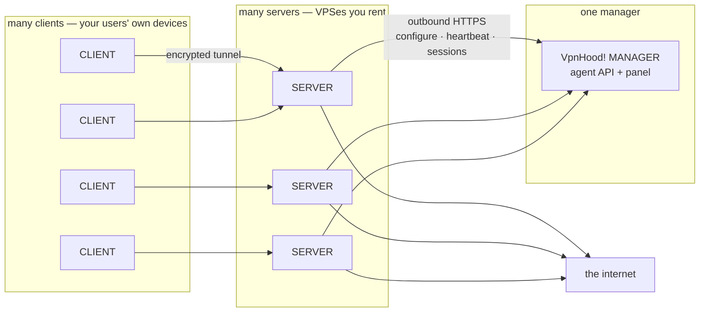

# Topology — who connects to whom

The three VpnHood components are easy to draw backwards. This page states the actual
direction of every connection, who may talk to whom, and how many of each there are.

If you remember one sentence: **every runtime connection is opened outward by the
managed thing.** The server dials the manager. The client dials the server. Nothing
dials into a client, and nothing dials into a server except clients.

---

## The pieces

| Piece | What it is | Where it runs |
| --- | --- | --- |
| **VpnHood! MANAGER** | The control panel and its agent API. Holds servers, farms, access tokens, usage. | A web service (hosted for you, or your own Access Manager implementation) |
| **VpnHood! SERVER** | The node that carries traffic. | A VPS or dedicated box you rent — not the user's device — [`src/Apps/Server`](../src/Apps/Server) |
| **VpnHood! CLIENT / CONNECT** | The end-user app. | The user's phone, desktop, or TV |
| **Access key** | A base64 blob the user pastes. Not a component, but it is how a client learns anything at all. | Issued by the manager, delivered by you |

## The shape



**Cardinality:** one manager holds many servers; each server carries many clients. A
server belongs to exactly one manager — it is configured with a single access-manager
base URL and has nowhere else to report.

---

## The rules

### 1. The client never contacts the manager

Not at install, not at connect, not ever. The app has no manager address and no code
that could use one: `IAccessManager` lives in
[`VpnHood.Core.Server.Access`](../src/Core/Server/Access/Access/Managers/IAccessManager.cs),
a **server** assembly, and neither `VpnHood.Core.Client` nor
`VpnHood.Core.Client.Abstractions` references it.

What the client actually knows comes from the access key it was given. Decode one
([`Token`](../src/Core/Common/Tokens/Token.cs) →
[`ServerToken`](../src/Core/Common/Tokens/ServerToken.cs)) and you find
`HostName`, `HostPort`, `HostEndPoints`, `Urls`, `ServerLocations` — **server**
endpoints. There is no manager URL in a token, because the client has no reason for one.

> Not to be confused with: the Client and Connect apps *do* talk to VpnHood's own
> account and store services for sign-in, subscriptions, and ads. That is a different
> system and has nothing to do with a self-hoster's MANAGER. A self-hosted deployment's
> manager never sees an end user.

### 2. The server connects to the manager, never the reverse

The server is the *client* of the manager's API. Every call in
[`IAccessManager`](../src/Core/Server/Access/Access/Managers/IAccessManager.cs) is
made by the server, outbound:

| Call | When | Why |
| --- | --- | --- |
| `Server_Configure` | on start | hand over `ServerInfo`, receive `ServerConfig` back |
| `Server_UpdateStatus` | periodically | heartbeat and load; the response carries a `ServerCommand` |
| `Session_Create` | a client presented a key | ask whether this token may open a session |
| `Session_Get` / `Session_GetAll` | during a session | re-check validity |
| `Session_AddUsage` / `Session_AddUsages` | during a session | report traffic |
| `Session_Close` | session ends | final usage |
| `Acme_GetHttp01KeyAuthorization` | certificate renewal | answer an ACME HTTP-01 challenge |

Note the direction of `Server_UpdateStatus`: the manager does **not** poll servers. It
answers a heartbeat and can piggyback an instruction on the reply — that is the whole
mechanism by which a panel "controls" a server.

Transport is plain HTTPS to `api/agent/` under the configured base URL, with a static
`Authorization` header — see
[`HttpAccessManager`](../src/Core/Server/Access/Access/Managers/HttpAccessManagers/HttpAccessManager.cs)
and its
[options](../src/Core/Server/Access/Access/Managers/HttpAccessManagers/HttpAccessManagerOptions.cs).
Configured in `appsettings.json`:

```json
{
  "HttpAccessManager": {
    "BaseUrl": "https://manager.example.com",
    "Authorization": "Bearer <server secret>"
  }
}
```

### 3. No manager at all is a supported mode

If `HttpAccessManager` is absent from settings, the server falls back to
[`FileAccessManager`](../src/Core/Server/Access/Managers/FileAccessManagement/FileAccessManager.cs)
and keeps its tokens in a local folder — the selection is a single branch in
[`ServerApp.cs`](../src/Apps/Server/ServerApp.cs). Same `IAccessManager` interface,
no network, no panel. The server does not know the difference.

This is why "does the server need the manager to run?" is answered *no*: the manager is
one implementation of an interface, not a dependency.

---

## What this means in practice

**Firewalls.** A server needs inbound only on its own `TcpEndPoints` (443 by default,
from clients) and outbound 443 to the manager. The manager needs **no** route into your
network and no inbound rule on your server. A server behind NAT with no port forwarding
still reports in fine — it just cannot receive clients.

**Blast radius.** The manager holds tokens and usage records. It never sees, proxies, or
can request user traffic — that path is client → server → internet and the manager is
not on it.

**Losing the manager.** Servers keep carrying existing traffic; what breaks is anything
needing a fresh decision — new sessions, token changes, usage accounting. The server
detects `503`/`403` as maintenance mode (`IsMaintenanceMode` in `HttpAccessManager`)
rather than treating it as a fatal error.

### The one exception, and it is not a runtime one

The MANAGER panel can install a server for you over **SSH** if you hand it a login. That
is the manager reaching into your machine — but it is a one-off at provisioning time, it
is optional (the alternative is pasting a shell command yourself), and it belongs to the
MANAGER product rather than to anything in this repo. Once the server is running, the
direction is server → manager and stays that way.

This exception is the usual source of the backwards arrow: people see the panel install
a server and conclude the panel drives it. It does not.

---

## Common misreadings

| Wrong | Right |
| --- | --- |
| The app connects to the manager to get a key | You deliver the key out of band. The app only ever talks to servers. |
| The manager pushes config to servers | Servers pull config on start and heartbeat; commands ride back on the reply. |
| One manager, one server | One manager, many servers. |
| The manager can see user traffic | It is not on the traffic path at all. |
| Self-hosting requires the manager | `FileAccessManager` runs a server standalone. |

## See also

- [`docs/README.md`](README.md) — the documentation index
- Wiki: [Install VpnHood Server](https://github.com/vpnhood/VpnHood/wiki/Install-VpnHood-Server),
  [VpnHood MANAGER](https://github.com/vpnhood/VpnHood/wiki/VpnHood-MANAGER),
  [VpnHood Access Server](https://github.com/vpnhood/VpnHood/wiki/VpnHood-Access-Server)
