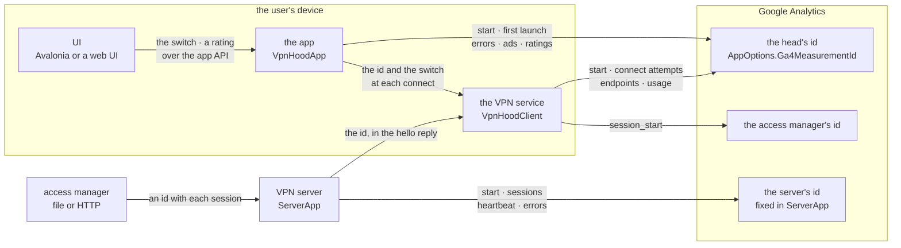
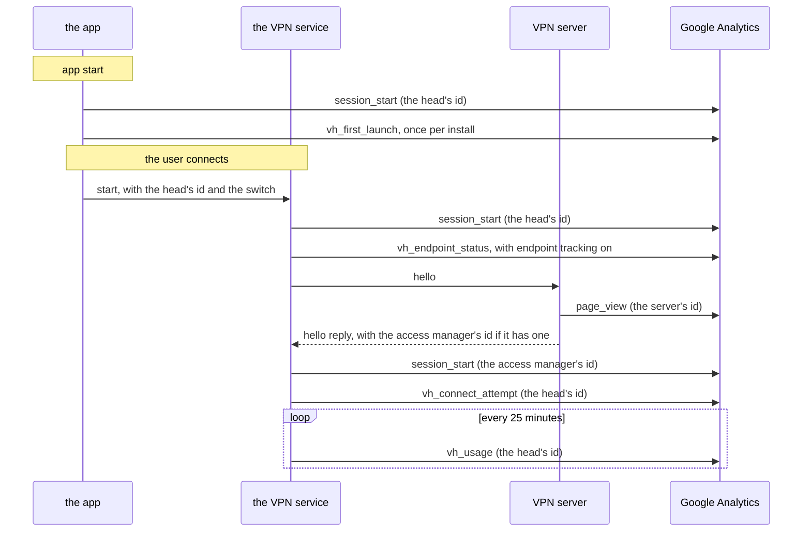

# Tracking — what the apps and the server report

What each VpnHood component sends to Google Analytics (GA4), to which id, and when, and the switch
that turns it off. Written for a maintainer checking what a build collects, and for a fork that must
report to its own property, or to none.

If you remember one sentence: **the app reports to the id its head names, the VPN server to an id
fixed in its code, and a server's access manager may name one more; the user's switch, Settings →
Privacy → "Share anonymous usage data", governs everything the device sends**, apart from the gaps
listed under [The switch](#the-switch).

---

## The pieces

| Reporter | Runs in | Reports to | Who names the id |
| --- | --- | --- | --- |
| **The app's tracker** | the app ([`VpnHoodApp`](../../src/AppLib/VpnHood.AppLib.App/VpnHoodApp.cs)) and, per connection, the VPN service ([`VpnHoodClient`](../../src/Core/VpnHood.Core.Client/VpnHoodClient.cs)) | the head's id | the head |
| **The access manager's tracker** | the VPN service, once per session | the id the server hands over at connect | whoever runs the access manager |
| **The server's tracker** | the VPN server ([`ServerApp`](../../src/Apps/Server/ServerApp.cs)) | its own id | fixed in its code |
| **The UI** | the device | nothing of its own: it reports through the app | — |

## The shape

## One connect, in order

---

## The app's tracker

**The id** is `AppOptions.Ga4MeasurementId` ([`AppOptions`](../../src/AppLib/VpnHood.AppLib.App/AppOptions.cs)).
It is null by default, and null sends nothing: a head that means to report names its own.
`AppOptions.TrackerFactory` replaces the tracker whole; Connect's Google Play head uses it to send
through Firebase's Android SDK. A Debug build always uses `NullTrackerFactory`, and the built-in
tracker without an id is a `NullTracker`. Nothing is sent then, and the UI hides the switch
(`AppFeatures.IsAnonymousTrackerSupported`).

**The app sends** ([`AppTrackerBuilder`](../../src/AppLib/VpnHood.AppLib.App/AppTrackerBuilder.cs),
[`TrackerExtensions`](../../src/Net/VpnHood.Net.Toolkit/Extensions/TrackerExtensions.cs)):

| Event | When | Carries |
| --- | --- | --- |
| `session_start` | the tracker is made: every app start | — |
| `vh_first_launch` | once per install | the client id, the country of the device's region |
| `vh_exception` | an error the app reports | where it happened, the message, the exception type, error or warning |
| `vh_user_review` | the user rates the app | the rating and the text |
| `vh_ad_show_ok`, `vh_ad_failed`, `vh_ad_load_failed`, `vh_ad_show_failed` | an ad shows or fails | the ad network, the country, whether it was preloaded, the result or the error |

**The VPN service sends** to the same id. It makes its own tracker for each connection, from the id
and the factory the app hands it in `ClientOptions`
([`VpnHoodClientFactory`](../../src/Core/VpnHood.Core.Client.VpnServices.Host/VpnHoodClientFactory.cs),
[`ClientTrackerBuilder`](../../src/Core/VpnHood.Core.Client/ClientTrackerBuilder.cs)):

| Event | When | Carries |
| --- | --- | --- |
| `session_start` | the tracker is made: each connect | — |
| `vh_endpoint_status` | a server endpoint is found reachable or not, with endpoint tracking on | the endpoint, its host name, IPv6 or not, reachable or not |
| `vh_connect_attempt` | the connect succeeds, or fails with endpoint tracking on | the server location, connected or not, IPv6 support, redirected or not, the endpoint |
| `vh_usage` | every 25 minutes while connected ([`ClientUsageTracker`](../../src/Core/VpnHood.Core.Client/ClientUsageTracker.cs)) | traffic total, sent and received in MB; request and connection counts |

Endpoint tracking is `AppOptions.AllowEndPointTracker`. It is off by default, and runs only while
the switch is on.

**Every hit** also carries the client id, a random session id, the app version, the language, and
the OS version and architecture
([`Ga4TagTracker`](../../src/Net/VpnHood.Net.Toolkit/Trackers/Ga4Tags/Ga4TagTracker.cs)). The client
id is a hash of the app id and the install's own id, the same one the VPN server sees.

## The access manager's tracker

A server's access manager may return a GA4 id with each session
([`SessionResponseEx`](../../src/Core/VpnHood.Core.Server.Access/Messaging/SessionResponseEx.cs)).
The server passes it on in the hello reply
([`HelloResponse`](../../src/Core/VpnHood.Core.Tunneling/Messaging/HelloResponse.cs)). While the
switch is on, the client sends that id one `session_start` for the session, with its client id and
app version ([`ClientSessionBuilder`](../../src/Core/VpnHood.Core.Client/ClientSessionBuilder.cs)).

The id belongs to whoever runs the access manager, not to whoever made the app. `FileAccessManager`
never returns one; an HTTP access manager may. Anything an access manager reports by itself is
outside this repo.

## The server's tracker

[`ServerApp`](../../src/Apps/Server/ServerApp.cs) reports to an id fixed in its code, under a random
id it keeps in its storage (`server-id`), with its version and its access manager's type
([`VpnHoodServer`](../../src/Core/VpnHood.Core.Server/VpnHoodServer.cs),
[`SessionManager`](../../src/Core/VpnHood.Core.Server/SessionManager.cs)):

| Event | When | Carries |
| --- | --- | --- |
| `session_start` | the server starts | — |
| `page_view` | a client opens a session | the client's and the server's version |
| `heartbeat` | every minute | the session count |
| `vh_exception` | configuring the server fails | the message and the exception type |

Its switch is `AllowAnonymousTracker` in the server's `appsettings.json`, on by default. A fork's
server reports to this id too, until the fork turns that off or changes the id.

## The UI

The UI is one concept, whichever one a head runs: the Avalonia UI in every head today, in process or
as its browser build, or a web UI such as the SPA sample.

1. It has no id of its own. What it reports goes through the app API into the app's tracker: a
   rating becomes `vh_user_review`.
2. It shows the switch on its Privacy page
   ([`PrivacyView`](../../src/AppUi/VpnHood.AppUi.Presentation.Classic.Avalonia/Views/PrivacyView.axaml.cs)),
   and hides it where the build collects nothing.
3. A web UI may add analytics of its own, set up from `AppFeatures.CustomData`: the SPA sample starts
   Firebase from `firebaseOptions` there, and only while the switch is on. The Avalonia UI adds none.

## The switch

`UserSettings.AllowAnonymousTracker` is on by default. A change takes effect at once.

| Report | Stopped by |
| --- | --- |
| The app's events | `VpnHoodApp.ApplySettings`, which sets the tracker's `IsEnabled` |
| A successful `vh_connect_attempt`, and the access manager's `session_start` | `VpnHoodClientConfig.AllowAnonymousTracker` |
| `vh_endpoint_status`, and a failed `vh_connect_attempt` | endpoint tracking, which runs only with the switch on |
| A web UI's own analytics | the web UI itself |

**Known gaps.** Three things do not work as the table says yet:

1. The app's `session_start` goes out at every start, while the tracker is made, before
   `ApplySettings` has read the switch.
2. The VPN service's `session_start` and `vh_usage` go out with the switch off:
   `VpnHoodClientFactory.CreateTracker` never reads `ClientOptions.AllowAnonymousTracker`.
3. On Connect's Google Play head, the VPN service sends nothing at all. The service runs in its own
   Android process, where nothing enables the Firebase tracker.

## Per head

| Head | The app's tracker |
| --- | --- |
| Client, Google Play | `G-4LE99XKZYE`, set in its [`App.cs`](../../src/Apps/Client/Client.Android.Google/App.cs) over the loaded settings |
| Client, website Android, Windows, Linux | none: no id, so the switch is hidden |
| Connect, Google Play | Firebase's Android SDK ([`FirebaseAnalyticsTracker`](../../src/Apps/Connect/Connect.Android.Google/FirebaseUtils/FirebaseAnalyticsTracker.cs)); Crashlytics follows the same switch |
| Connect, website Android, Windows, Linux | the id in its private `appsettings.json`, embedded at build; endpoint tracking as that file sets it |
| Client and Connect, iOS | none: `NullTrackerFactory`, no endpoint tracking, and `firebaseOptions` removed ([`AppDelegate`](../../src/Apps/Client/Client.Ios.Apple/AppDelegate.cs)) |
| Any head, Debug build | none |

## For a fork

1. Name your own id in `Ga4MeasurementId` to report; without one, the app sends nothing.
2. To use another analytics SDK, replace the tracker with `AppOptions.TrackerFactory`.
3. The server's id is in [`ServerApp`](../../src/Apps/Server/ServerApp.cs): change it, or turn
   `AllowAnonymousTracker` off.
4. Keep your store privacy answers and your privacy policy in line with what you send; see
   [APP_STORE_PRIVACY.md](../legal/developer/APP_STORE_PRIVACY.md).

## See also

- [APP_STORE_PRIVACY.md](../legal/developer/APP_STORE_PRIVACY.md): Apple's privacy questionnaire,
  answered from what the iOS build sends
- [legal/end-user/](../legal/end-user/README.md): the privacy policies users are shown
- [topology.md](../topology.md): who connects to whom
- [`docs/README.md`](../README.md): the documentation index
