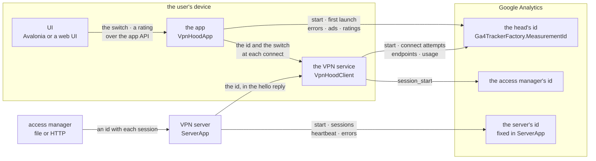
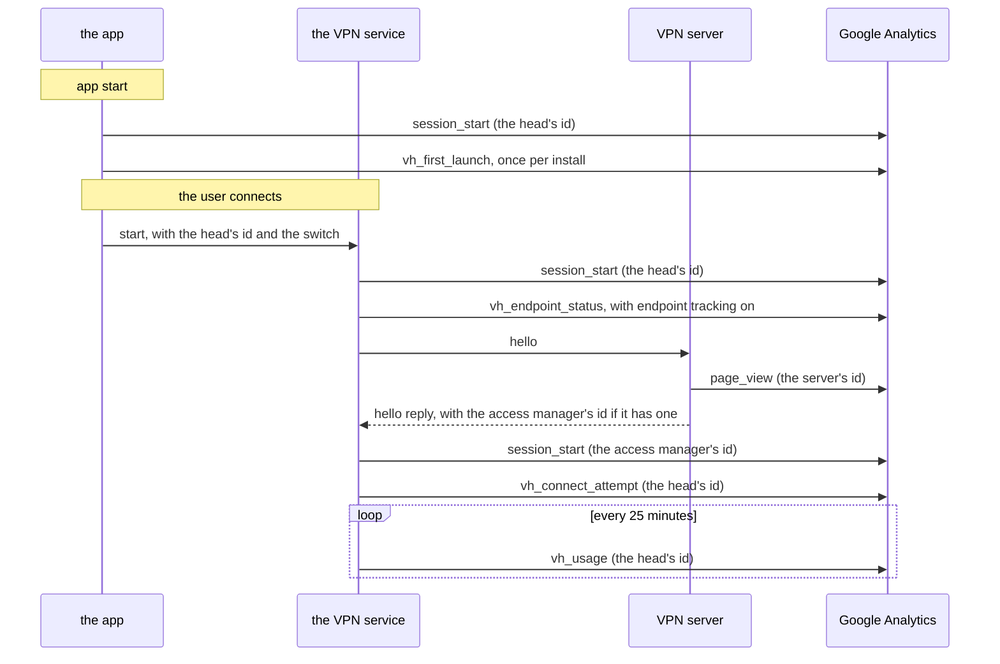

# Tracking — what the apps and the server report

What each VpnHood component sends to Google Analytics (GA4), to which id, and when, and the switch
that turns it off. Written for a maintainer checking what a build collects, and for a fork that must
report to its own property, or to none.

If you remember one sentence: **the app reports to the id its head names, the VPN server to an id
fixed in its code, and a server's access manager may name one more; the user's switch, Settings →
Privacy → "Share anonymous usage data", governs everything the device sends** ([The
switch](#the-switch)).

---

## The pieces

| Reporter | Runs in | Reports to | Who names the id |
| --- | --- | --- | --- |
| **The app's tracker** | the app ([`VpnHoodApp`](../../src/AppLib/VpnHood.AppLib.App/VpnHoodApp.cs)) and, per connection, the VPN service ([`VpnHoodClient`](../../src/Core/VpnHood.Core.Client/VpnHoodClient.cs)) | the head's id | the head |
| **The access manager's tracker** | the VPN service, once per session | the id the server hands over at connect | whoever runs the access manager |
| **The server's tracker** | the VPN server ([`ServerApp`](../../src/Apps/Server/ServerApp.cs)) | its own id | fixed in its code |
| **The UI** | the device | nothing of its own: it reports through the app | — |

## The shape


```mermaid
graph LR
    subgraph device["the user's device"]
        UI["UI<br/>Avalonia or a web UI"]
        APP["the app<br/>VpnHoodApp"]
        SVC["the VPN service<br/>VpnHoodClient"]
    end

    AM["access manager<br/>file or HTTP"]
    SRV["VPN server<br/>ServerApp"]

    subgraph ga["Google Analytics"]
        HEADID["the head's id<br/>Ga4TrackerFactory.MeasurementId"]
        AMID["the access manager's id"]
        SRVID["the server's id<br/>fixed in ServerApp"]
    end

    UI -- "the switch · a rating<br/>over the app API" --> APP
    APP -- "the id and the switch<br/>at each connect" --> SVC
    APP -- "start · first launch<br/>errors · ads · ratings" --> HEADID
    SVC -- "start · connect attempts<br/>endpoints · usage" --> HEADID
    AM -- "an id with each session" --> SRV
    SRV -- "the id, in the hello reply" --> SVC
    SVC -- "session_start" --> AMID
    SRV -- "start · sessions<br/>heartbeat · errors" --> SRVID
```

## One connect, in order


```mermaid
sequenceDiagram
    participant APP as the app
    participant SVC as the VPN service
    participant SRV as VPN server
    participant GA as Google Analytics

    Note over APP: app start
    APP->>GA: session_start (the head's id)
    APP->>GA: vh_first_launch, once per install
    Note over APP,SVC: the user connects
    APP->>SVC: start, with the head's id and the switch
    SVC->>GA: session_start (the head's id)
    SVC->>GA: vh_endpoint_status, with endpoint tracking on
    SVC->>SRV: hello
    SRV->>GA: page_view (the server's id)
    SRV-->>SVC: hello reply, with the access manager's id if it has one
    SVC->>GA: session_start (the access manager's id)
    SVC->>GA: vh_connect_attempt (the head's id)
    loop every 25 minutes
        SVC->>GA: vh_usage (the head's id)
    end
```

---

## The app's tracker

**The id** is the `MeasurementId` of the
[`Ga4TrackerFactory`](../../src/Core/VpnHood.Core.Client.VpnServices.Abstractions/Tracking/Ga4TrackerFactory.cs)
a head lists in `AppOptions.TrackerFactories` ([`AppOptions`](../../src/AppLib/VpnHood.AppLib.App/AppOptions.cs)).
The list is empty by default, so a head that means to report names its own; VpnHood's products list
GA4 with the id from their private appsettings, and Connect's Google Play head lists Firebase's
Android SDK in its place. Each factory makes one tracker, and several report as one, each getting the
switch and every event (`CompositeTracker`). A Debug build makes none, whatever the head lists, and a
GA4 factory without an id makes a `NullTracker`. Nothing is sent then, and the UI hides the switch
(`AppFeatures.IsAnonymousTrackerSupported`).

**The app sends** ([`AppTrackerBuilder`](../../src/AppLib/VpnHood.AppLib.App/AppTrackerBuilder.cs),
[`TrackerExtensions`](../../src/Net/VpnHood.Net.Toolkit/Extensions/TrackerExtensions.cs)):

| Event | When | Carries |
| --- | --- | --- |
| `session_start` | the tracker is made, with the switch on: every app start, but not the first run of a head that shows the first-run terms, where it is made switched off | — |
| `vh_first_launch` | once per install | the client id, the country of the device's region |
| `vh_exception` | an error the app reports | where it happened, the message, the exception type, error or warning |
| `vh_user_review` | the user rates the app | the rating and the text |
| `vh_ad_show_ok`, `vh_ad_failed`, `vh_ad_load_failed`, `vh_ad_show_failed` | an ad shows or fails | the ad network, the country, whether it was preloaded, the result or the error |

**The VPN service sends** to the same id. It makes its own trackers for each connection, from the
factories the app hands it in `ClientOptions`, each made again from its type and its settings
([`VpnHoodClientFactory`](../../src/Core/VpnHood.Core.Client.VpnServices.Host/VpnHoodClientFactory.cs),
[`ClientTrackerBuilder`](../../src/Core/VpnHood.Core.Client/ClientTrackerBuilder.cs)):

| Event | When | Carries |
| --- | --- | --- |
| `session_start` | the tracker is made, with the switch on: each connect | — |
| `vh_endpoint_status` | a server endpoint is found reachable or not, with endpoint tracking on | the endpoint, its host name, IPv6 or not, reachable or not |
| `vh_connect_attempt` | the connect succeeds, or fails with endpoint tracking on | the server location, connected or not, IPv6 support, redirected or not, the endpoint |
| `vh_usage` | every 25 minutes while connected ([`ClientUsageTracker`](../../src/Core/VpnHood.Core.Client/ClientUsageTracker.cs)) | traffic total, sent and received in MB; request and connection counts |

Endpoint tracking is `AppOptions.AllowEndPointTracker`. It is off by default, and runs only while
the switch is on.

**Every hit** also carries the client id, a random session id, the app version, the language, and
the OS version and architecture
([`Ga4TagTracker`](../../src/Net/VpnHood.Net.Toolkit/Trackers/Ga4Tags/Ga4TagTracker.cs)). The client
id is a hash of the app id and the install's own id, the same one the VPN server sees.

## The access manager's tracker

A server's access manager may return a GA4 id with each session
([`SessionResponseEx`](../../src/Core/VpnHood.Core.Server.Access/Messaging/SessionResponseEx.cs)).
The server passes it on in the hello reply
([`HelloResponse`](../../src/Core/VpnHood.Core.Tunneling/Messaging/HelloResponse.cs)). While the
switch is on, the client sends that id one `session_start` for the session, with its client id and
app version ([`ClientSessionBuilder`](../../src/Core/VpnHood.Core.Client/ClientSessionBuilder.cs)).
A build without a tracker of its own (iOS, a Debug build) tells the VPN service the switch is off,
so it sends none.

The id belongs to whoever runs the access manager, not to whoever made the app. `FileAccessManager`
never returns one; an HTTP access manager may. Anything an access manager reports by itself is
outside this repo.

## The server's tracker

[`ServerApp`](../../src/Apps/Server/ServerApp.cs) reports to an id fixed in its code, under a random
id it keeps in its storage (`server-id`), with its version and its access manager's type
([`VpnHoodServer`](../../src/Core/VpnHood.Core.Server/VpnHoodServer.cs),
[`SessionManager`](../../src/Core/VpnHood.Core.Server/SessionManager.cs)):

| Event | When | Carries |
| --- | --- | --- |
| `session_start` | the server starts | — |
| `page_view` | a client opens a session | the client's and the server's version |
| `heartbeat` | every minute | the session count |
| `vh_exception` | configuring the server fails | the message and the exception type |

Its switch is `AllowAnonymousTracker` in the server's `appsettings.json`, on by default. A fork's
server reports to this id too, until the fork turns that off or changes the id.

## The UI

The UI is one concept, whichever one a head runs: the Avalonia UI in every head today, in process or
as its browser build, or a web UI such as the SPA sample.

1. It has no id of its own. What it reports goes through the app API into the app's tracker: a
   rating becomes `vh_user_review`.
2. It shows the switch on its Privacy page
   ([`PrivacyView`](../../src/AppUi/VpnHood.AppUi.Presentation.Classic.Avalonia/Views/PrivacyView.axaml.cs)),
   and hides it where the build collects nothing.
3. It adds no analytics of its own, the Avalonia UI and the SPA sample alike. A web UI of one's own
   may, set up from `AppFeatures.CustomData`, and only while the switch is on.

## The switch

`UserSettings.AllowAnonymousTracker` is on by default. A change takes effect at once, in a running
VPN session too. On a head that shows the first-run terms (`AppOptions.IsLicenseAgreementRequired`),
every tracker stays switched off until they are accepted.

| Report | Stopped by |
| --- | --- |
| Each tracker's `session_start` | `TrackerCreateParams.IsEnabled`: the app and the VPN service make every tracker with the switch, and one made switched off sends nothing |
| The app's events | [`AppTrackerService`](../../src/AppLib/VpnHood.AppLib.App/Services/Trackers/AppTrackerService.cs), which sets the tracker's `IsEnabled` at each settings save |
| The VPN service's `vh_usage` | its tracker, made with the switch, and set in a running session by the reconfigure the app sends on every change |
| A VPN service started without the app, from its saved options (always-on, the quick-settings tile, the system restarting it) | the switch in those options ([`VpnServiceOptionsFile`](../../src/Core/VpnHood.Core.Client.VpnServices.Abstractions/VpnServiceOptionsFile.cs)), saved at each connect and at each settings change, connected or not |
| A successful `vh_connect_attempt`, and the access manager's `session_start` | `VpnHoodClientConfig.AllowAnonymousTracker` |
| `vh_endpoint_status`, and a failed `vh_connect_attempt` | endpoint tracking, which runs only with the switch on |
| A web UI's own analytics | the web UI itself |

## Per head

| Head | The app's tracker |
| --- | --- |
| Client, Google Play, website Android, Windows, Linux; Connect, website Android, Windows, Linux | the id in its private `appsettings.json`, embedded at build (CI writes it from the publishing repo's `APPSETTINGS` variable); endpoint tracking as that file sets it |
| Connect, Google Play | Firebase's Android SDK ([`FirebaseAnalyticsTracker`](../../src/Apps/Connect/Connect.Android.Google/FirebaseUtils/FirebaseAnalyticsTracker.cs)), in the app's process and in the VPN service's own, each set to the switch; Crashlytics follows the same switch |
| Client and Connect, iOS | none: no tracker factory and no endpoint tracking ([`AppDelegate`](../../src/Apps/Client/Client.Ios.Apple/AppDelegate.cs)), until Apple's rules for a VPN app are checked |
| Any head, Debug build | none |

## Seeing it on a device

A Debug build shows little of this: it sends nothing, and on Android it keeps the VPN service in the
app's own process, where a Release build gives it one of its own (`:vpnhood_process`). To watch what
an Android build sends to Firebase, turn on Firebase's debug mode, whose events stay out of the
reports, and its log:

```sh
adb shell setprop debug.firebase.analytics.app <package>
adb shell setprop log.tag.FA VERBOSE
adb shell setprop log.tag.FA-SVC VERBOSE
```

logcat then shows each event as Google Play services' measurement service logs it (`FA-SVC`,
`Logging event: ... name=...`) and each upload (`Successful upload`), from whichever of the app's
processes logged it. `adb shell setprop debug.firebase.analytics.app .none.` ends debug mode.

## For a fork

1. List `new Ga4TrackerFactory { MeasurementId = <your id> }` in `AppOptions.TrackerFactories` to
   report; without a factory, the app sends nothing.
2. To use another analytics SDK, list its tracker factory in `AppOptions.TrackerFactories`, beside
   the GA4 one or in its place. The VPN service makes each factory again in its own process, from its
   type and its public properties, so a factory keeps its settings in public properties and has a
   public constructor without arguments
   ([`ITrackerFactory`](../../src/Core/VpnHood.Core.Client.VpnServices.Abstractions/Tracking/ITrackerFactory.cs)).
3. The server's id is in [`ServerApp`](../../src/Apps/Server/ServerApp.cs): change it, or turn
   `AllowAnonymousTracker` off.
4. Keep your store privacy answers and your privacy policy in line with what you send; see
   [APP_STORE_PRIVACY.md](../legal/developer/APP_STORE_PRIVACY.md).

## See also

- [APP_STORE_PRIVACY.md](../legal/developer/APP_STORE_PRIVACY.md): Apple's privacy questionnaire,
  answered from what the iOS build sends
- [legal/end-user/](../legal/end-user/README.md): the privacy policies users are shown
- [topology.md](../topology.md): who connects to whom
- [`docs/README.md`](../README.md): the documentation index
